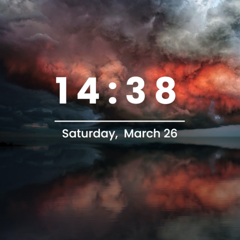

<h1 align='center'>yaspage</h1>
<h3 align='center'>Yet Another Start Page inspired by <a href="https://github.com/cadejscroggins/tilde">cadejcsroggins/tilde</a></h3>

<table>
	<tbody>
		<tr>
			<td>
				
			</td>
            <td>
                
            </td>
        </tr>
    </tbody>
</table>

### Extensibility
As with Tilde, yaspage is meant to be customizable
* Add default commands in the <a href="https://github.com/rvikwd3/yaspage/blob/main/src/commands.js">commands.js</a> file
* Add default default suggestions in  the <a href="https://github.com/rvikwd3/yaspage/blob/main/src/suggestionDefaults.js">suggestionDefaults.js</a> file